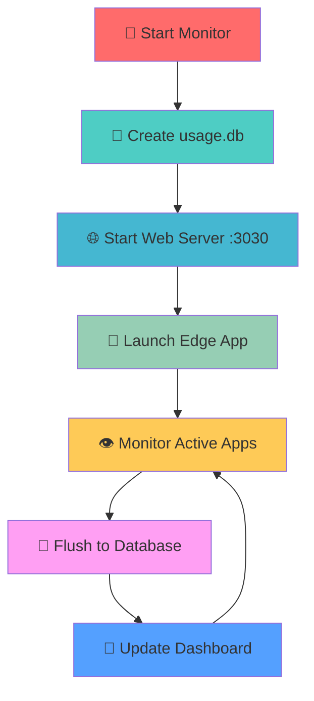

# 🖥️ System Monitor

<div align="center">


**A lightweight Windows screen-time and activity monitor with a modern web-based GUI**

[]()
[]()
[]()

</div>

---

## ✨ Features

| Feature | Description | Status |
|---------|-------------|--------|
| 🔍 **Real-time Monitoring** | Tracks active applications every second | ✅ Active |
| 🌐 **Browser Detection** | Identifies Chrome, Edge, Firefox, and Brave | ✅ Active |
| 🔗 **URL Extraction** | Extracts current tab URLs from browser windows | ✅ Active |
| 🎨 **Modern Web GUI** | Beautiful, responsive dashboard with dark mode | ✅ Active |
| 📱 **Edge App Mode** | Launches in native-like Edge app window | ✅ Active |
| ⚡ **Efficient Storage** | Uses hashbrown::HashMap for in-memory tracking | ✅ Active |
| 💾 **SQLite Persistence** | Flushes data to database every 30 seconds | ✅ Active |
| 🚀 **Low Resource Usage** | <1% CPU on idle, <100MB memory | ✅ Active |
| 🔌 **REST API** | JSON API endpoints for dashboard data | ✅ Active |

---

## 🎯 Dashboard Overview

```
┌─────────────────────────────────────────────────────────────┐
│                    🖥️ System Monitor Dashboard              │
├─────────────────┬───────────────────────────────────────────┤
│  📊 Current Activity    │        📈 Statistics             │
│  • msedge.exe           │        • Uptime: 2h 15m         │
│  • System Monitor       │        • Tracked Apps: 25        │
│  • http://localhost     │        • Active Now: 1           │
├─────────────────┴───────────────────────────────────────────┤
│                    📋 Recent Activity                       │
│  🌐 Chrome.exe (45m)                                        │
│    ├── GitHub (15m)                                         │
│    ├── Stack Overflow (20m)                                │
│    └── YouTube (10m)                                        │
│  🔥 Firefox.exe (30m)                                       │
│    ├── ChatGPT (25m)                                        │
│    └── Reddit (5m)                                          │
└─────────────────────────────────────────────────────────────┘
```

---

## 🛠️ Requirements

| Requirement | Version | Purpose |
|-------------|---------|---------|
| 🪟 **Windows** | 10/11 | Operating system |
| 🦀 **Rust** | Latest | Programming language |
| 🔧 **MSYS2 MinGW64** | Latest | Build environment |
| 🌐 **Microsoft Edge** | Latest | App mode launcher |

---

## 🚀 Quick Start

### 1️⃣ **Installation**
```bash
# Clone the repository
git clone https://github.com/itzmeJan/sysmonitor.git
cd sysmonitor

# Build the project
cargo build --release
```

### 2️⃣ **Running**
```bash
# Start the monitor
cargo run --release
```

### 3️⃣ **Access Dashboard**
- 🌐 **Auto-launch**: Edge app window opens automatically
- 🔗 **Manual**: Visit `http://localhost:3030`
- 📱 **App Mode**: `msedge --app http://localhost:3030 --window-size=800,600`

---

## 📊 What Happens When You Run



---

## 🎨 Web Interface Features

### 📱 **Dashboard Sections**

| Section | Description | Auto-refresh |
|---------|-------------|--------------|
| 🎯 **Current Activity** | Active app, window title, URL | ✅ 2s |
| 📊 **Statistics** | Uptime, tracked apps, active count | ✅ 2s |
| 📋 **Recent Activity** | Historical usage with hierarchical grouping | ✅ 2s |

### 🌙 **Theme Support**
- 🌞 **Light Mode**: Clean, modern light theme
- 🌙 **Dark Mode**: Auto-detects system preference
- 🎨 **Glassmorphism**: Modern glass-like design
- 📱 **Responsive**: Optimized for small PWA windows

---

## 🔌 API Endpoints

| Endpoint | Method | Description | Response |
|----------|--------|-------------|----------|
| `/api/dashboard` | GET | Dashboard data | JSON |
| `/api/health` | GET | Health check | JSON |
| `/` | GET | Main dashboard | HTML |
| `/static/*` | GET | Static assets | CSS/JS |

### 📝 **Example API Response**
```json
{
  "uptime": 135,
  "total_apps": 25,
  "active_apps": [
    ["msedge.exe:http://localhost:3030", 45]
  ],
  "recent_activity": [
    {
      "app_name": "chrome.exe",
      "window_title": "GitHub",
      "url": "https://github.com",
      "timestamp": 1703123456,
      "duration": 900
    }
  ]
}
```

---

## 💾 Database Schema

```sql
CREATE TABLE usage_logs (
    id INTEGER PRIMARY KEY AUTOINCREMENT,
    identifier TEXT NOT NULL,
    app_name TEXT NOT NULL,
    window_title TEXT NOT NULL,
    url TEXT,
    timestamp INTEGER NOT NULL,
    duration INTEGER NOT NULL
);
```

### 📊 **Data Flow**
```
Active App → Identifier → HashMap → SQLite → Dashboard
    ↓           ↓           ↓         ↓         ↓
msedge.exe → msedge.exe:URL → RAM → usage.db → Web UI
```

---

## 🏗️ Project Structure

```
📁 sysmonitor/
├── 📁 src/
│   └── 📄 main.rs              # 🦀 Main Rust application
├── 📁 web/
│   ├── 📄 index.html           # 🌐 Dashboard HTML
│   └── 📁 static/
│       ├── 📄 style.css        # 🎨 Modern CSS styling
│       └── 📄 script.js        # ⚡ Dashboard JavaScript
├── 📄 Cargo.toml              # 📦 Dependencies & config
├── 📄 usage.db                # 💾 SQLite database
└── 📄 README.md               # 📖 This file
```

---

## ⚙️ Technical Details

### 🔧 **Core Technologies**
- **🦀 Rust**: High-performance system programming
- **🪟 Win32 API**: Windows system integration
- **🌐 Warp**: Async web server framework
- **💾 SQLite**: Lightweight database
- **🎨 CSS3**: Modern styling with custom properties
- **⚡ JavaScript**: Dynamic dashboard updates

### 🚀 **Performance Metrics**
- **CPU Usage**: <1% on idle systems
- **Memory Usage**: <100MB with thousands of records
- **Update Frequency**: Every 1 second
- **Database Flush**: Every 30 seconds
- **Dashboard Refresh**: Every 2 seconds

### 🔒 **Thread Safety**
- `Arc<Mutex<HashMap>>` for shared state
- Atomic operations for counters
- Graceful error handling
- Transaction-based database writes

---

## 🎯 Configuration

### ⏰ **Timing Constants**
```rust
const ACTIVITY_RETENTION_HOURS: u64 = 24;    // Keep data for 1 day
const MAX_RECENT_ACTIVITIES: usize = 1000;   // Show all activities
```

### 🌐 **Server Settings**
- **Port**: 3030
- **Host**: localhost
- **CORS**: Enabled for local development

---

## 🔮 Future Enhancements

| Feature | Priority | Status |
|---------|----------|--------|
| 📊 **Charts & Graphs** | High | 🚧 Planned |
| 📤 **Export (CSV/JSON)** | Medium | 🚧 Planned |
| 🏷️ **Activity Categories** | Medium | 🚧 Planned |
| 🔔 **Usage Notifications** | Low | 💡 Ideas |
| 🎨 **Custom Themes** | Low | 💡 Ideas |
| 📱 **Mobile App** | Low | 💡 Ideas |

---

## 🤝 Contributing

We welcome contributions! Here's how you can help:

1. 🍴 **Fork** the [repository](https://github.com/itzmeJan/sysmonitor)
2. 🌿 **Create** a feature branch
3. ✨ **Make** your changes
4. 🧪 **Test** thoroughly
5. 📝 **Submit** a pull request

---

## 📄 License

This project is licensed under the MIT License - see the [LICENSE](LICENSE) file for details.

---

## 🙏 Acknowledgments

- 🦀 **Rust Community** for the amazing ecosystem
- 🪟 **Microsoft** for Windows API documentation
- 🌐 **Web Standards** for modern browser APIs
- 💡 **Open Source** community for inspiration

---

<div align="center">

**Made with ❤️ and 🦀 Rust**

[⭐ Star this repo](https://github.com/itzmeJan/sysmonitor) • [🐛 Report Bug](https://github.com/itzmeJan/sysmonitor/issues) • [💡 Request Feature](https://github.com/itzmeJan/sysmonitor/issues)

</div>